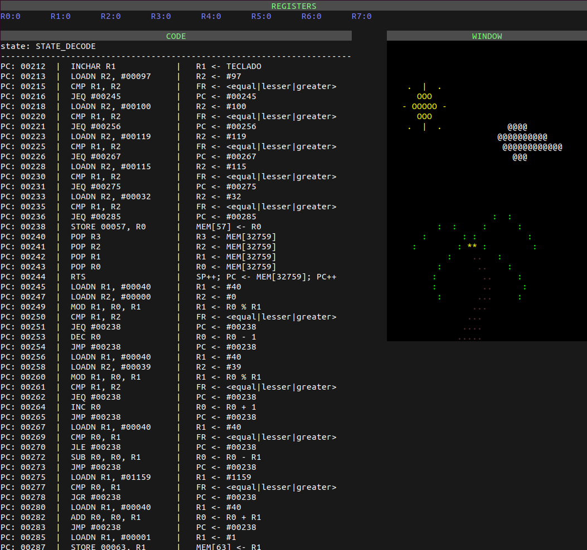
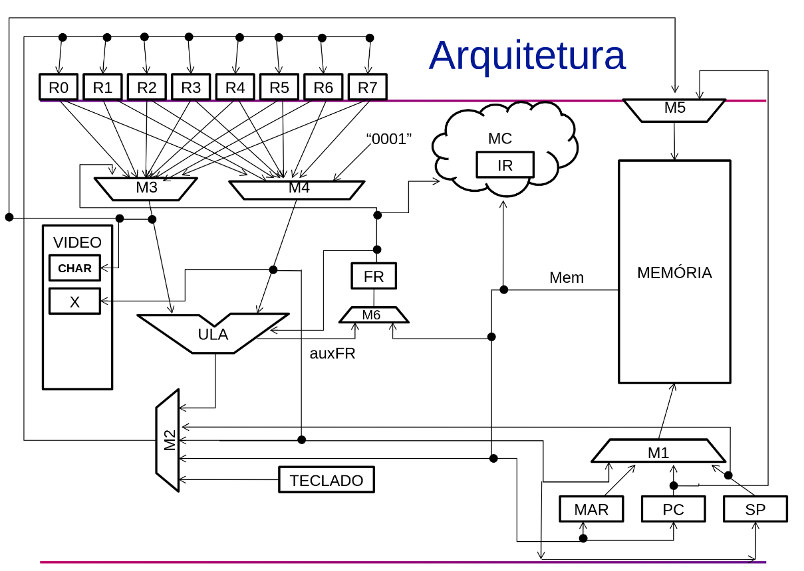

# SimuladorMIPS
REA (Recurso Educacional Aberto) para a disciplina de Organização e Arquitetura de Computadores.

O trabalho foi desenvolvido como um complemento para o projeto Processador-ICMC - https://github.com/simoesusp/Processador-ICMC, criado pelo professor Eduardo Simões, a fim de ensinar e aprender Organização e Arquitetura de Computadores.

O principal objetivo é adicionar uma ferramenta de visualização ao ambiente e facilitar o aprendizado dos alunos, familiarizando-os com o processador desenvolvido.
 
Desenvolvemos um simulador do processador que executa o código os códigos montados e mostra o estado atual do processador e os caminhos ativos em cada ciclo. A arquitetura e seus caminhos são mostrados através de uma janela do OpenGL. As linhas de instruções, os valores dos registradores, e a saída de vídeo são apresentados através de uma interface de terminal desenvolvida com curses.

Vídeo do simulador funcionando: https://youtu.be/eYd-wCxaJ6Q

<p align="center">


</p>

Tentamos manter a distribuição dos componentes fiel a que o professor Eduardo Simões utiliza na imagem de apresentação da arquitetura para os alunos.
<p align="center">
 
 </p>

Atualmente a visualização está funcionando como descrito, porém, a velocidade do simulador ainda precisa ser melhorada, visto que a execução dos jogos está bem mais lenta do que o encontrado na FPGA e no atual simulador da disciplina. Acreditamos que isto está relacionado com a taxa de atualização da janela do OpenGL e do curses. Outro ponto a ser melhorado é a apresentação da arquitetura, que está $hardcoded$, o ideal seria que esta fosse variável de acordo com o código do simulador, de forma a permitir analisar outras arquiteturas construídas pelos alunos.

Agradecimentos ao Professor Eduardo Simões <3 https://github.com/simoesusp

### Instalação
```
git clone https://github.com/madukm/arquiteturaProcessador-ICMC.git
sudo apt-get install -y libglfw3-dev
sudo apt-get install -y libglew-dev
sudo apt-get install -y libncurses5-dev libncursesw5-dev
```

### Desenvolvido por

Breno Cunha Queiroz https://github.com/Brenocq

Maria Eduarda Kawakami Moreira
